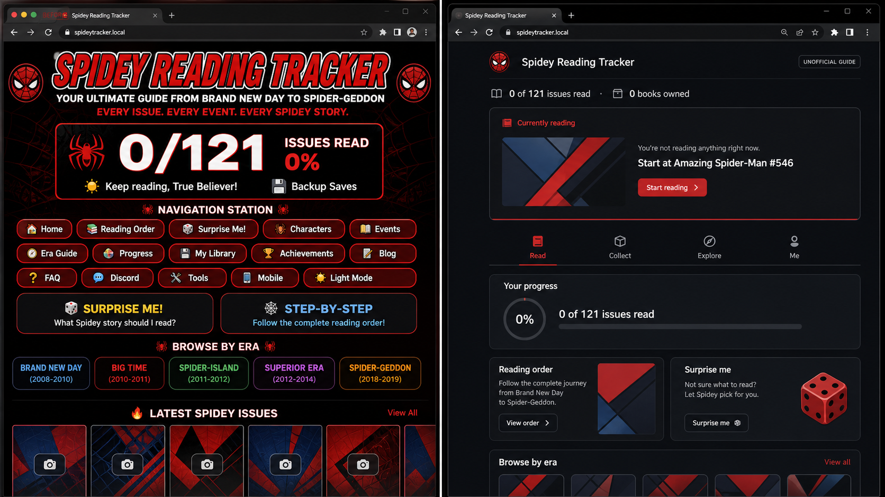
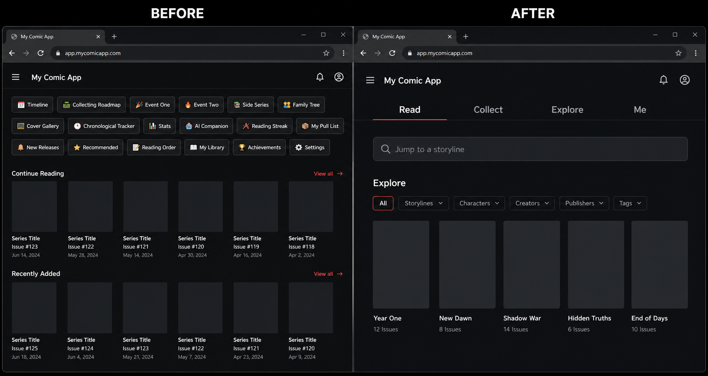
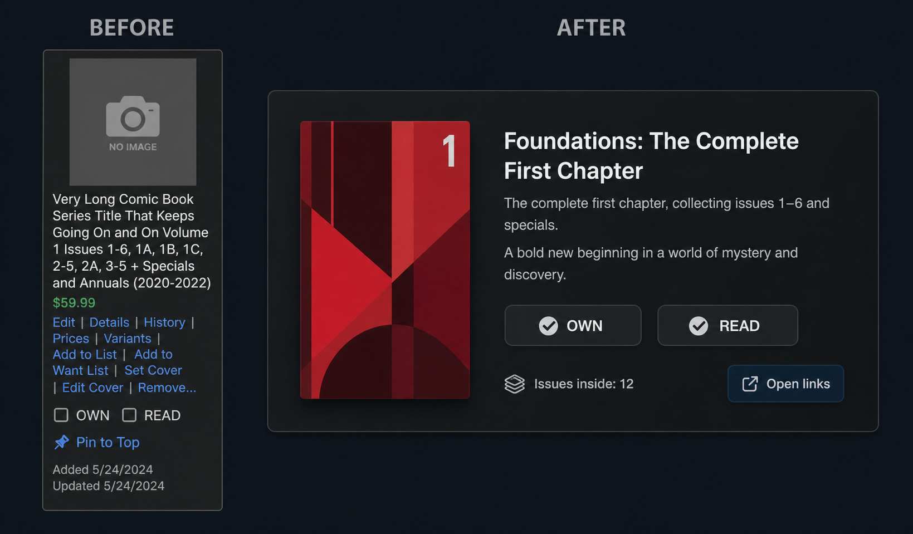
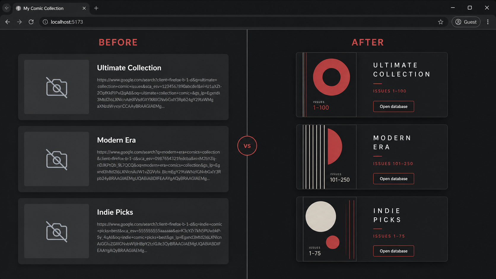
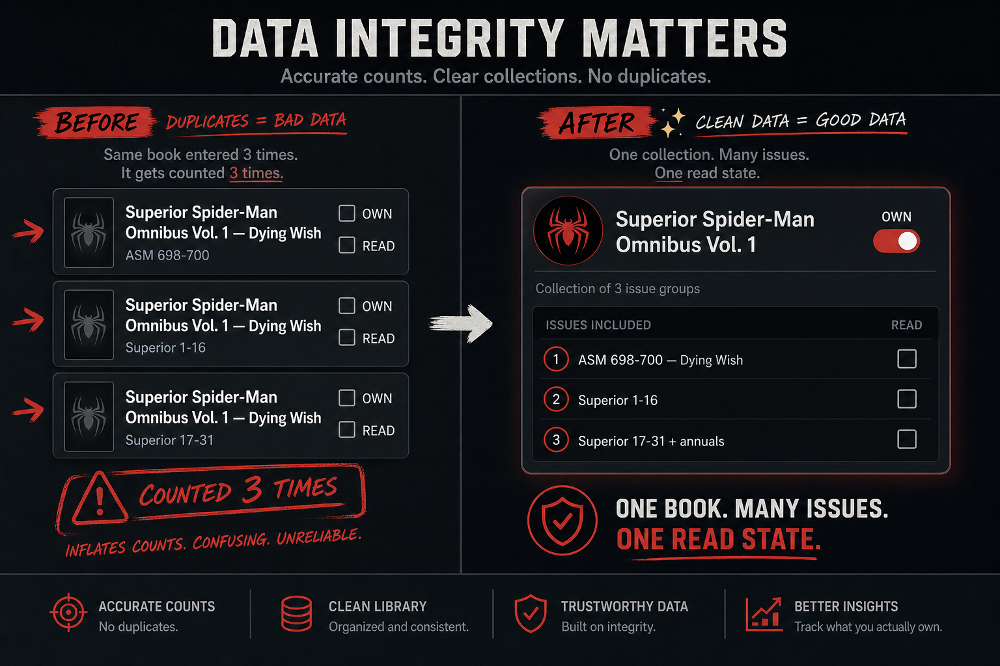
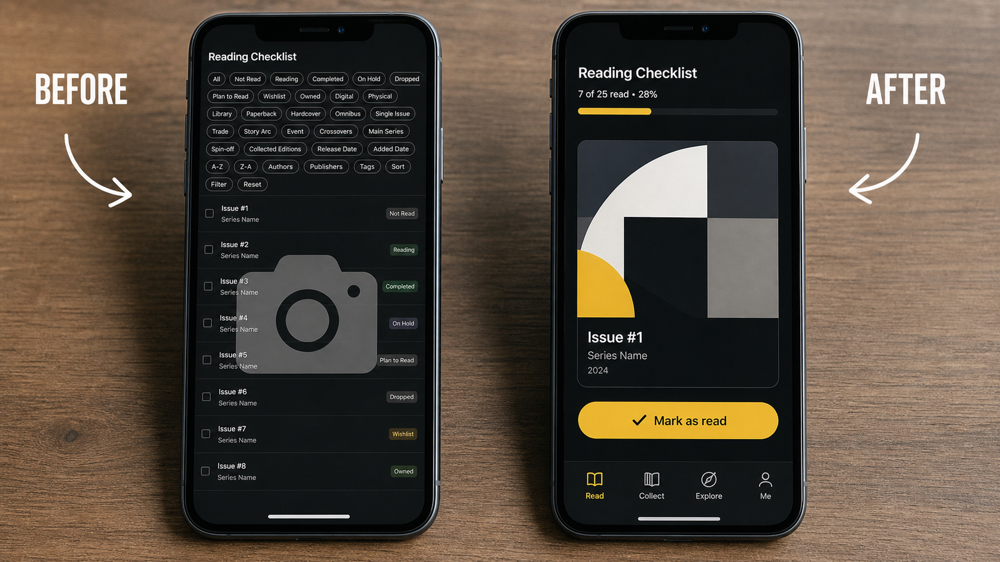
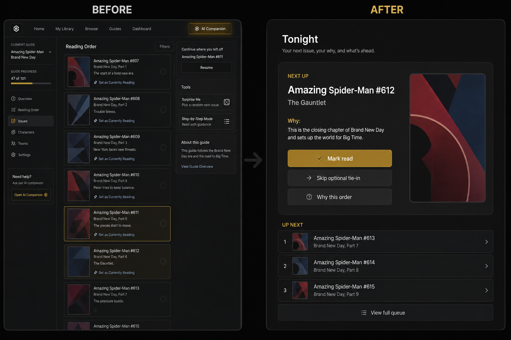
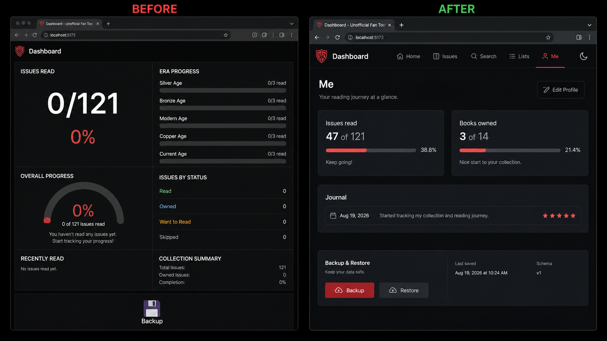

# CLAUDE HANDOFF — Spidey Reading Tracker v2

**Who this is for:** Claude (or any coding agent) updating [spidey-reading-tracker.netlify.app](https://spidey-reading-tracker.netlify.app/).

**How to use this file:** Treat this as the spec. Do not invent a new information architecture. Do not put issue facts in HTML. Match the prototype in `app/` and the catalog in `data/`. The eight images under `before-after/` are the visual contract.

**Date:** 2026-08-19  
**Live site:** https://spidey-reading-tracker.netlify.app/  
**Working prototype (this repo):** `app/index.html` + `data/catalog.json`

---

## 0. Mission

Rebuild the tracker so a session answers one question in under 10 seconds:

> What do I read or buy tonight?

Claude already got the **spine and the collector voice** right (Brand New Day → Spider-Geddon, OWN/READ, blurbs, Currently Reading, Backup). The live site fails on **data integrity, links/covers, and 16-tab IA**.

You are not designing a new product. You are replacing the monolith with:

- `data/` as source of truth
- `app/` as UI only
- two progress meters (issues read ≠ books owned)
- four nav items: **Read / Collect / Explore / Me**

---

## 1. Visual contract — eight before & afters

These are concept reconstructions of the live DOM (left) vs the v2 you must ship (right). Open the PNGs. Do not ship the left side.

### 01 — Home header



**After:** unofficial badge, **issues read / total** and **books owned / total**, start-here (ASM #546). No slogan wall. No 16 tools in the header.

### 02 — Navigation



**After:** four tabs only. Events are filters under Explore. Search is first-class (“Jump to Grim Hunt”).

### 03 — Collection card



**After:** poster + title + range + two-line why + OWN + READ. Outbound links one level down, not five wrapping search URLs.

### 04 — Covers and links



**After:** no camera-emoji placeholders. Typographic posters if you cannot host Marvel art. One working Open button (GCD or stored URL). Never build a URL from the raw card title.

### 05 — Data overlaps (highest priority)



**After:** Superior Spider-Man Omnibus Vol. 1 is **one** ownable book. Dying Wish (ASM #698–700) + Superior #1–31 + annuals are issues *inside* it. One READ per issue.

### 06 — Mobile



**After:** thumb-first. 44px Mark read / OWN / READ. Tabs do not wrap into three rows. Sticky current / tonight.

### 07 — Tonight / Next up



**After:** Currently Reading + Step-by-Step + Surprise Me + AI Companion collapse into one **Tonight** panel: next issue, why, skip optional, mark read, next 3 queue.

### 08 — Stats and backup



**After:** two meters. Backup **and** Restore. `schemaVersion`. Last-saved timestamp. Optional journal later.

---

## 2. What is wrong with the live site (do not preserve)

Copy this checklist into the PR description and tick as you kill each item.

### Catalog

| ID | Bug | v2 fix already in `data/` |
|---|---|---|
| D1 | Big Time `#648–656` **and** gap `#648–697` nest | Gap is only uncollected remainder (`big-time-gap`) |
| D2 | Dying Wish + Superior #1–16 + #17–31 each look like Superior Omni Vol. 1 | One collection `superior-omni-1` |
| D3 | Avenging + Team-Up + Superior Vol. 2 all claim Returns Omni | One collection `superior-returns-omni` |
| D4 | Worldwide listed as ASM 2015 `#1–32` only | Gap through `#50` (`worldwide-gap`) |
| D5 | Spider-Geddon is “#0–5 + tie-ins” | Named issues in `spider-geddon-tpb` |
| D6 | Header `0/121` issues vs era `0/3` books | Two meters; total = `issues.length` (305 in current catalog) |
| D7 | “View issues (6)” on 30+ floppy ranges | Expand count === `issueIds.length` |
| D8 | Prices with no date | `msrp` + `msrpAsOf` |
| D9 | No ISBN / GCD / MU ids | Start with `isbn` / `links.gcd` on collections |
| D10 | No skip flags | `priority`: required / recommended / optional |
| D11 | Events are separate apps | `eventTags[]` + Explore filters |
| D13 | Gap cards can be OWN | `type: "gap"` → Own disabled |
| X1 | Fake issue counts in omni expand | Audit script |
| X2 | Gap re-ranges the whole era | Fixed in generator |
| X4 | Secret Invasion glued into BND Vol. 1 title | Optional tagged arc |
| X11 | 121 hardcoded | Always `issues.length` |
| X13 | Blurbs spoil Dying Wish / Peter’s return | `spoiler: true` + veil |

### UI / product

- 16 top-level tabs (Timeline, Collecting Roadmap, every event, Family Tree, Cover Gallery, Chronological Tracker, Stats, AI Companion).
- Three “order” tools at once.
- Every cover is 📷.
- Fandom / GCD / Cover Browser / Marvel links search strings like `Amazing Spider-Man #546–583 + Secret Invasion tie-in`.
- Backup with no Restore.
- Currently Reading buried on the card.
- No search.
- Emoji-as-icons.
- One HTML dump.

### Keep from the old site

- Spine: BND → Big Time → Dying Wish → Superior → Spider-Verse → Geddon.
- Side tracks as *future Explore packs*, not home tabs: Civil War, Secret Wars 2015, Civil War II, 2099, Ultimate, Venom, Web of Spider-Man.
- Voice of the blurbs (why Grim Hunt matters, Otto mind-swap).
- OWN, READ, must-read, unofficial disclaimer.

---

## 3. Hard rules (break these and the site rots again)

1. Progress **issues read** = `readIssueIds.length / issues.length`. Collections never increment that number.
2. Progress **books owned** = owned collections with `type !== "gap"`.
3. **One issue, one READ.** Many collections may contain an issue; the UI still shows one Read.
4. **OWN lives on collections.** Gaps cannot be owned.
5. **No outbound URL built from a concatenated title.**
6. **Nav is only** Read, Collect, Explore, Me.
7. **AI cannot invent an issue** not in `data/issues.json`. Do not put AI in primary nav. Tonight is deterministic.
8. Spoiler blurbs stay veiled until reveal or the issue is read.
9. Do not rewrite `data/*.json` and `app/*` in the same change unless adding a single issue end-to-end.
10. After catalog edits: `python3 scripts/build_catalog.py` then `python3 scripts/audit.py` (must print `OK`).
11. Tap targets ≥ 44px. No emoji icons as the only label.
12. Do not hotlink official Marvel cover art. Use posters or stored allowed URLs.
13. Keep the unofficial / not-affiliated disclaimer visible.
14. Export JSON must include `schemaVersion: 1` (bump only with a migrator).

---

## 4. Repo map (implement against this, not a new tree)

```
CLAUDE-HANDOFF-REPORT.md   ← this spec
CLAUDE.md                  ← short rules
COMPLETE-IMPROVEMENT-PLAYBOOK.md
SPIDEY-TRACKER-DIAGNOSTIC.md
before-after/              ← 01–08 PNGs + gallery index.html
data/catalog.json          ← app loads this
data/issues.json
data/collections.json
scripts/build_catalog.py   ← edit facts here
scripts/audit.py
app/index.html
app/styles.css
app/app.js
```

**Prototype behavior already shipped in `app/`:** Tonight panel, era filters, search, Read/Own, gap not ownable, two meters, backup/restore, spoiler toggle, undo toast, mark remaining in a collection.

If you are updating Netlify: publish `app/` **and** `data/` so `fetch('../data/catalog.json')` works, **or** copy `catalog.json` next to `index.html` and fix the fetch path. Do not upload the old single-file tracker on top.

---

## 5. Data model (do not change shape without bumping schema)

```text
Issue
  id, series, number, year
  title, arc, era, blurb
  priority: required | recommended | optional
  eventTags[], spoiler, readingOrder
  gcdSearch?

Collection
  id
  type: omnibus | tpb | hc | digital | gap
  title, era, year
  isbn?, msrp?, msrpAsOf?
  issueIds[]          // ordered, unique
  blurb, coverHue
  links: { gcd?, marvel? }
  mustRead?

UserState  (localStorage key srt-v2-state)
  schemaVersion: 1
  readIssueIds[]
  ownedCollectionIds[]
  currentlyReading
  notes, ratings
  lastBackup
```

Current generated catalog (audit OK): **305 issues**, **11 collections**, **0 issues in more than one ownable collection**.

Collections you must not split back into duplicate OWN rows:

- `superior-omni-1` — ASM 698–700 + Superior 1–31 + annuals
- `superior-returns-omni` — Avenging + Team-Up + 2018 Superior + Returns + Superior 2023
- `big-time-gap` — only issues **not** in Big Time Omni or Spider-Island Omni

---

## 6. Screen-by-screen spec

### Read (default)

- Tonight card from first unread `priority !== "optional"` issue in `readingOrder`.
- Queue of next 3 unread (optional may appear in the queue, labeled).
- Mark read, Set as current, undo toast.
- Era chips from `catalog.eras`.
- Search over series, number, title, arc, blurb.
- Issue row: poster (not 📷), label `Series #n`, priority, spoiler-safe blurb, one Read toggle.

### Collect

- One card per collection.
- Own disabled when `type === "gap"` + gold note: you cannot own a hole.
- `r/n issues read` where n = `issueIds.length`.
- Mark remaining read.
- One outbound: `links.gcd` if present.

### Explore

- Event tags as filters that jump to Read + search.
- Family tree / Web of Destiny / 2099 / Ultimate / Civil War: **stubs** until they are packs of the same issue IDs. Do not build a second database.

### Me

- Two meters explained.
- Backup JSON download + Restore file input.
- Spoiler toggle.
- Reset local data with confirm.

---

## 7. Shipping to the live Netlify site

1. Get the real Netlify repo or drag-drop publish directory.
2. Replace it with this `app/` + `data/` (or a bundled copy).
3. Confirm `catalog.json` loads (Network tab). Header total must equal `issues.length`.
4. Run `python3 scripts/audit.py` in CI or by hand before each catalog publish.
5. Keep `noindex` if this stays a personal tool.
6. Do not reintroduce the 16-tab nav “so nothing is lost.” Put leftovers under Explore.

---

## 8. Definition of done

- [ ] Header total === `issues.length`
- [ ] Two meters, never mixed
- [ ] Zero ownable collections that re-count the same book as three cards
- [ ] Gaps cannot be marked OWN
- [ ] Expand / issue list count === `issueIds.length`
- [ ] No 📷 leftovers
- [ ] No search-string outbound links
- [ ] Four primary nav items
- [ ] Tonight + next 3
- [ ] Export + Restore + schemaVersion
- [ ] Undo on READ/OWN
- [ ] Spoiler veil default on
- [ ] Audit script prints OK
- [ ] Mobile: nav one row or bottom tabs; 44px targets
- [ ] Disclaimer + unofficial badge
- [ ] UI matches the eight AFTER frames above

---

## 9. Prompt you can paste if context is tight

```
You are updating Spidey Reading Tracker. Read CLAUDE-HANDOFF-REPORT.md and CLAUDE.md first.
Use data/catalog.json as the only issue/collection source. UI is app/.
Match the AFTER sides of before-after/01 through 08.
Do not add tabs. Do not add AI to primary nav. Do not hotlink Marvel covers.
Do not split Superior Omni Vol. 1 or Returns Omni back into multiple OWN cards.
Run python3 scripts/audit.py and keep it OK.
Ship Read / Collect / Explore / Me with Tonight, two progress meters, backup+restore.
```

---

## 10. Bottom line for Claude

The old site is a clever checklist that **lies about what a book is**. v2 is boring and correct: issues are the truth, collections are containers, Tonight is the home, and the mockups in `before-after/` are what “finished” looks like.

If you improve visuals, improve toward those AFTER frames — darker charcoal, one red accent, serif titles, posters not cameras, fat Read buttons. If you improve data, change `scripts/build_catalog.py`, regenerate, audit. Never type issue ranges into `index.html`.
